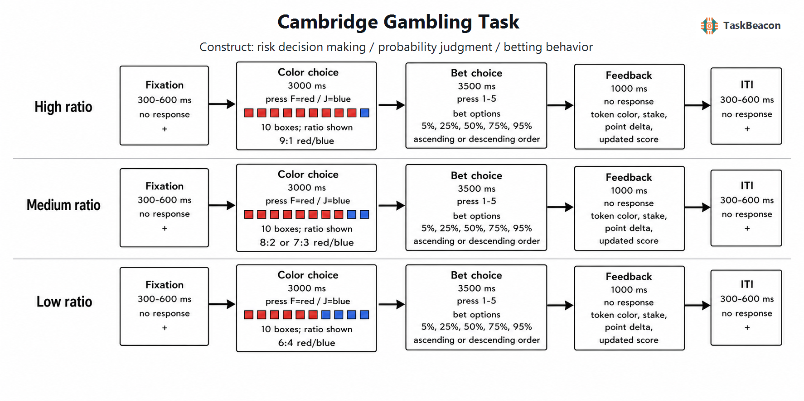

# 剑桥赌博任务：显性风险决策的过程分解、经验发现与测量边界

风险决策研究需要区分至少三类彼此相关但不可互换的过程：对客观概率的利用、在给定概率下承担多少风险，以及对等待成本和结果反馈的敏感性。若任务要求参与者从经验中学习选项价值，学习速率、工作记忆与反转学习便会混入风险偏好的估计。剑桥赌博任务（Cambridge Gambling Task, CGT）以可见的红蓝方块比例直接给出结果概率，并把颜色判断与下注分为连续阶段，因而能够在较少依赖增量学习的条件下测量显性风险决策（Rogers et al., 1999a）。这一操作优势使 CGT 广泛用于额叶损伤、成瘾、发展与精神病理研究；同时，多阶段结构也意味着其总分不能被视为单一“冲动性”指标。可靠解释必须把构念限定到相应任务阶段、实验对比和测量指标。

## 1. 范式提出与理论背景

CGT 最初用于刻画慢性兴奋剂或阿片使用者、局灶性前额叶损伤患者及色氨酸耗竭健康参与者的决策差异。研究者设计该任务的核心目的，是在结果概率显式可见的条件下，将概率判断、下注幅度和下注顺序效应分离，从而减少 Iowa Gambling Task 一类经验学习范式中规则发现与记忆负荷的影响（Rogers et al., 1999a）。因此，CGT 所测的是风险条件下的决策，而非概率未知时的模糊决策。参与者仍需形成主观价值，但无须跨试次推断哪一选项长期有利。

早期神经影像版本进一步操纵奖励大小与获胜概率之间的冲突。小而可能的结果与大而不可能的结果之间的选择招募眶额及下额叶区域，提示显性概率和收益幅度的整合依赖多个前额叶区域，而单一脑区标签不足以概括该过程（Rogers et al., 1999b）。随后，标准 CGT 将“先判断较可能颜色、再按当前积分比例下注”的流程固定下来，并以 9:1、8:2、7:3、6:4 的方块比例提供由高到低的概率证据。方法学上的关键进展是形成可分别描述判断质量、下注水平、风险调节、审议时间与下注顺序敏感性的指标组。

## 2. 任务逻辑、流程与核心指标

经典试次先呈现十个红蓝方块，参与者判断黄色标记更可能藏在哪种颜色下。多数颜色选择率构成决策质量（quality of decision-making）；从刺激出现到颜色选择的潜伏期构成审议时间。颜色判断完成后，参与者以当前积分的一定比例下注。常见比例为 5%、25%、50%、75% 和 95%，并在升序或降序条件中按固定时间间隔依次出现；选择正确则增加相应积分，错误则扣除相应积分（Zois et al., 2014）。概率信息在试次开始时已经给出，故结果反馈主要改变当前可下注积分，而不承担学习隐藏规则的功能。

指标解释必须绑定具体操作。风险承担通常指选择多数颜色的试次中平均下注比例，以避免将明显不利的颜色判断混入下注倾向；总体下注比例则包括更广泛的有效试次。风险调节（risk adjustment）描述下注比例随多数颜色优势从 6:4 增至 9:1 而上升的程度，常用加权函数综合四种比例，因此较高值支持“下注对显式胜率更敏感”的判断，但也受总体下注水平和极端比例使用频率影响（Lewis et al., 2022）。决策质量反映是否利用概率线索，不能直接等同于理性决策，因为任务未测量个人效用、损失承受能力或现实财务约束。

经典延迟厌恶指标来自升序与降序下注条件的差异。在比例依次出现的版本中，高额下注在升序条件需要等待，在降序条件则较早出现；降序下注高于升序下注因而可能反映不愿等待。该对比同时受到时间折扣、反应准备、序列锚定与停止规则影响，不能单独证明稳定的延迟折扣倾向。跨任务建模也显示，CGT 的时间折扣参数与标准延迟折扣任务参数联系较弱，前者与反应抑制失败的关系更紧密（Kvam et al., 2021）。

## 3. 主要行为与神经科学发现

### 3.1 概率利用、风险承担与个体差异

健康成人通常在优势比例增大时提高多数颜色选择率并增加下注，表明判断质量与风险调节可以在同一任务中分离。年龄研究发现，成年期风险承担随年龄增长而降低，但这一群体趋势不能自动归因于风险态度改变，因为加工速度、对积分的主观价值及代际经验也随年龄变化（Deakin et al., 2004）。大规模青少年队列进一步表明，11 至 14 岁期间存在显著性别差异，风险调节亦呈发展变化；经性别及家庭社会因素调整后，风险承担与后续抑郁症状之间没有令人信服的总体关联（Lewis et al., 2022）。这些结果说明人口学变量既可能是发展现象，也可能是临床比较中的混杂因素。

临床研究较一致地发现，异常可以出现在不同阶段。问题赌博者与酒精依赖者均表现出较高下注和认知冲动性，而审议减慢与工作记忆缺陷更偏向酒精依赖组，提示相近的高风险行为可能由不同认知组合产生（Lawrence et al., 2009）。赌博障碍研究还显示，物质使用共病会改变风险程度，但多数颜色选择受损并不完全由共病解释（Zois et al., 2014）。近期跨 20 类心理障碍的比较在 572 名年轻成人中观察到风险调节、决策质量和总体下注比例的广泛组间差异；样本允许共病且按单项诊断分别比较，因此这些结果适合描述跨诊断关联，不适合建立疾病特异性标志（Effah et al., 2024）。

发展与纵向应用进一步扩大了 CGT 的用途。儿童注意缺陷多动障碍研究将较差风险调节与下注顺序敏感性区分开来；四年随访中，基线样本仅部分完成复测，下注顺序相关指标仍预测后续人际问题，但小样本与观察性设计限制了因果解释（Sørensen et al., 2024）。治疗研究则表明，传统指标与计算模型参数都可关联脱落风险，而损失敏感性等模型参数可能捕捉摘要分数未显示的随访变化；该发现尚需独立样本验证（Todesco et al., 2022）。

### 3.2 脑损伤与功能影像证据

局灶性损伤证据支持风险决策的功能分解。腹内侧前额叶损伤与不随胜率变化的普遍较高下注相关，岛叶损伤则主要表现为下注不能随显式胜率调整；两组在该研究中的概率判断并无显著差异（Clark et al., 2008）。这一区分提示，下注水平和风险调节对应不同计算需求，也说明群体行为差异不能仅凭脑区受损位置归结为统一的“冲动控制缺陷”。损伤研究较功能影像更接近必要性证据，但样本量、病灶异质性及远隔网络效应仍限制精细定位。

事件相关功能磁共振成像（fMRI）将颜色判断、下注和结果阶段分开后发现：多数颜色下注与涉及决策、工作记忆和学习的分布式活动相关；获胜结果引起奖赏相关区域及控制相关区域的血氧水平依赖（BOLD）信号变化；在选择多数颜色后意外失败，相对于预期获胜产生更强岛叶反应（Yazdi et al., 2019）。早期正电子发射断层成像同样显示，概率与收益冲突增加时，下额叶和眶额区域参与选择（Rogers et al., 1999b）。这些条件差异支持前额叶—岛叶—纹状体网络参与概率、价值与结果整合，但不能由相关性活动推出某一区域单独生成风险偏好。现有任务特异性 EEG/ERP 证据尚不足以形成稳定的阶段性结论，因而不宜用一般反馈相关负波或奖赏正波文献替代 CGT 证据。

## 4. 范式发展与方法学应用

CGT 的主要发展方向是将传统摘要指标转化为潜在过程参数。层级贝叶斯模型可同时估计颜色选择一致性、概率扭曲、损失敏感性和等待成本。在物质使用障碍样本中，模型参数揭示了传统指标未检测到的组间差异，同时与传统测量保持较强聚合关系（Romeu et al., 2020）。联合认知模型则显示，两种都被称为“冲动性”的任务参数未必共享同一潜变量（Kvam et al., 2021）。计算建模的价值在于明确生成行为的候选过程，而非把拟合参数自动升级为真实心理机制；参数可识别性、模型比较和样本外预测仍是必要条件。

任务也被用于药理、脑损伤、赌博与物质依赖、情绪障碍及神经发育研究。其共同优势是显式概率、较低学习负荷和多指标输出，适合检验“判断是否正确”与“正确判断后愿意下注多少”能否分离。应用范围扩大也带来版本差异：是否兑换真实金钱、比例出现速度、试次数、升降序是否逐项呈现、是否包含仅判断阶段，以及结果反馈形式，都会改变动机强度和延迟厌恶的含义。跨研究综合应优先比较操作相同的指标，而不能只依据任务名称合并效应。

## 5. 信度、效度与解释边界

CGT 具有清晰的表面效度和阶段分离优势，但稳定的群体平均效应不保证个体排序可靠。EMOTICOM 中改编的赢/输分离版 CGT 对风险调节报告了约 .75 的重测相关；该版本使用轮盘及分离的收益、损失条件，不能据此断言标准 CGT 所有指标均具有同等信度（Bland et al., 2016）。标准指标的可靠性还会随每种比例的有效试次数、极端下注的分布和超时规则变化。将 CGT 用于个体差异或临床结局预测时，应报告指标级重测或分半信度，并考虑层级模型对测量误差的处理。

构念效度方面，多数颜色选择直接反映显式概率利用；风险调节比单纯平均下注更接近概率敏感性；升降序差异只有在下注值随时间依次出现时才包含等待成本。风险调节低可能来自概率加权异常、损失厌恶、反应噪声或对积分缺乏动机，平均下注高也可能反映效用曲线、财富效应或任务策略。反馈改变累计积分，使后期试次的绝对赌注依赖既往结果；若只分析百分比，仍不能完全消除接近破产与积分下限的影响。群体差异因而不能直接用于个体诊断，横断面临床关联也不足以证明症状由风险决策异常导致。

## 6. TaskBeacon 中的任务实现

### 6.1 任务资源与访问入口

| 资源 | ID | 用途 | 地址 |
|---|---|---|---|
| 完整行为实验实现 | T000029 | PsychoPy/PsyFlow 中文行为采集 | https://github.com/TaskBeacon/T000029-cambridge-gambling |
| 浏览器预览源码 | H000029 | 与 T 版流程对齐的网页行为预览，不替代实验室采集环境 | https://github.com/TaskBeacon/H000029-cambridge-gambling |

两个公开仓库及其 ID 已由一手项目元数据核验。当前仓库元数据未给出可独立核验的直接公共运行地址，故不列入体验链接。T000029 与 H000029 均标记为行为采集；浏览器版本用于预览任务流程，不应表述为 EEG、MRI 或临床采集版本的等价替代。

### 6.2 实现流程与关键参数

**图 1. TaskBeacon 当前版本的 CGT 试次流程。** 每个试次依次经历 0.3–0.6 s 注视、最长 3.0 s 颜色判断、最长 3.5 s 下注、1.0 s 反馈及 0.3–0.6 s 试次间隔。系统从 9:1、8:2、7:3、6:4 中抽取比例，随机指定红或蓝为多数颜色及其左右位置，并按可见比例抽取标记颜色；参与者以 F 选择红色、J 选择蓝色。颜色判断有效后，五个下注比例同时显示，数字键 1–5 映射到本组的升序 5%、25%、50%、75%、95% 或降序 95%、75%、50%、25%、5%。赌注为当前积分乘下注比例后的四舍五入整数，判断正确加分、错误减分，积分最低为 0。颜色判断超时则不下注且积分不变；下注超时自动采用屏幕最后一个比例。该版本没有难度阶梯或基于表现的概率自适应，跨试次变化仅包括随机比例、标记结果和累计积分更新。

| 参数 | TaskBeacon 当前设置 | 分析含义 |
|---|---|---|
| 结构 | 2 组，每组 36 次，共 72 次；先升序、后降序 | 下注顺序与组次固定共线 |
| 初始积分 | 100 | 结果按当前积分比例累加或扣减 |
| 方块比例 | 9:1、8:2、7:3、6:4 | 支持多数颜色选择率与风险调节分析 |
| 下注比例 | 5%、25%、50%、75%、95%，同屏呈现 | 测量下注选择；不复现经典逐项等待成本 |
| 主要记录 | 颜色与下注反应、反应时、是否选多数颜色、输赢、下注额、积分变化、超时 | 可构成判断质量、下注比例及顺序差异等摘要量 |

TaskBeacon 当前版本保留了显式概率判断、比例下注和结果更新的核心结构，但下注选项为同屏呈现。升序与降序仅改变屏幕位置—按键映射，没有使高额或低额选项等待不同时间。因此，仓库所计算的“降序平均下注－升序平均下注”应解释为下注排列顺序效应代理量，不能直接等同于经典 CGT 的延迟厌恶。固定先升序后降序还使该差异可能包含练习、疲劳和积分轨迹。下注超时在升序组自动选择 95%、在降序组自动选择 5%，故超时试次会机械性扩大顺序差异；主要分析宜预先规定排除或单独建模这些试次。现有仓库文件也无法确认积分是否兑换为实际金钱，研究报告应将其描述为积分反馈，除非实验方案另有明确规定。

## 参考文献

Bland, A. R., Roiser, J. P., Mehta, M. A., Schei, T., Boland, H., Campbell-Meiklejohn, D. K., Emsley, R. A., Munafò, M. R., Penton-Voak, I. S., Seara-Cardoso, A., Viding, E., Voon, V., Sahakian, B. J., Robbins, T. W., & Elliott, R. (2016). EMOTICOM: A neuropsychological test battery to evaluate emotion, motivation, impulsivity, and social cognition. *Frontiers in Behavioral Neuroscience, 10*, Article 25. https://doi.org/10.3389/fnbeh.2016.00025

Clark, L., Bechara, A., Damasio, H., Aitken, M. R. F., Sahakian, B. J., & Robbins, T. W. (2008). Differential effects of insular and ventromedial prefrontal cortex lesions on risky decision-making. *Brain, 131*(5), 1311–1322. https://doi.org/10.1093/brain/awn066

Deakin, J., Aitken, M., Robbins, T., & Sahakian, B. J. (2004). Risk taking during decision-making in normal volunteers changes with age. *Journal of the International Neuropsychological Society, 10*(4), 590–598. https://doi.org/10.1017/S1355617704104104

Effah, R., Ioannidis, K., Grant, J. E., & Chamberlain, S. R. (2024). Exploring decision-making performance in young adults with mental health disorders: A comparative study using the Cambridge gambling task. *Psychological Medicine, 54*(9), 1890–1896. https://doi.org/10.1017/S0033291724000746

Kvam, P. D., Romeu, R. J., Turner, B. M., Vassileva, J., & Busemeyer, J. R. (2021). Testing the factor structure underlying behavior using joint cognitive models: Impulsivity in delay discounting and Cambridge gambling tasks. *Psychological Methods, 26*(1), 18–37. https://doi.org/10.1037/met0000264

Lawrence, A. J., Luty, J., Bogdan, N. A., Sahakian, B. J., & Clark, L. (2009). Problem gamblers share deficits in impulsive decision-making with alcohol-dependent individuals. *Addiction, 104*(6), 1006–1015. https://doi.org/10.1111/j.1360-0443.2009.02533.x

Lewis, G., Srinivasan, R., Roiser, J., Blakemore, S.-J., Flouri, E., & Lewis, G. (2022). Risk-taking to obtain reward: Sex differences and associations with emotional and depressive symptoms in a nationally representative cohort of UK adolescents. *Psychological Medicine, 52*(13), 2805–2813. https://doi.org/10.1017/S0033291720005000

Rogers, R. D., Everitt, B. J., Baldacchino, A., Blackshaw, A. J., Swainson, R., Wynne, K., Baker, N. B., Hunter, J., Carthy, T., Booker, E., London, M., Deakin, J. F., Sahakian, B. J., & Robbins, T. W. (1999a). Dissociable deficits in the decision-making cognition of chronic amphetamine abusers, opiate abusers, patients with focal damage to prefrontal cortex, and tryptophan-depleted normal volunteers: Evidence for monoaminergic mechanisms. *Neuropsychopharmacology, 20*(4), 322–339. https://doi.org/10.1016/S0893-133X(98)00091-8

Rogers, R. D., Owen, A. M., Middleton, H. C., Williams, E. J., Pickard, J. D., Sahakian, B. J., & Robbins, T. W. (1999b). Choosing between small, likely rewards and large, unlikely rewards activates inferior and orbital prefrontal cortex. *The Journal of Neuroscience, 19*(20), 9029–9038. https://doi.org/10.1523/JNEUROSCI.19-20-09029.1999

Romeu, R. J., Haines, N., Ahn, W.-Y., Busemeyer, J. R., & Vassileva, J. (2020). A computational model of the Cambridge gambling task with applications to substance use disorders. *Drug and Alcohol Dependence, 206*, Article 107711. https://doi.org/10.1016/j.drugalcdep.2019.107711

Sørensen, L., Adolfsdottir, S., Kvadsheim, E., Eichele, H., Plessen, K. J., & Sonuga-Barke, E. (2024). Suboptimal decision making and interpersonal problems in ADHD: Longitudinal evidence from a laboratory task. *Scientific Reports, 14*, Article 6535. https://doi.org/10.1038/s41598-024-57041-x

Todesco, S., Chao, T., Schmid, L., Thiessen, K. A., & Schütz, C. G. (2022). Changes in loss sensitivity during treatment in concurrent disorders inpatients: A computational model approach to assessing risky decision-making. *Frontiers in Psychiatry, 12*, Article 794014. https://doi.org/10.3389/fpsyt.2021.794014

Yazdi, K., Rumetshofer, T., Gnauer, M., Csillag, D., Rosenleitner, J., & Kleiser, R. (2019). Neurobiological processes during the Cambridge gambling task. *Behavioural Brain Research, 356*, 295–304. https://doi.org/10.1016/j.bbr.2018.08.017

Zois, E., Kortlang, N., Vollstädt-Klein, S., Lemenager, T., Beutel, M., Mann, K., & Fauth-Bühler, M. (2014). Decision-making deficits in patients diagnosed with disordered gambling using the Cambridge Gambling Task: The effects of substance use disorder comorbidity. *Brain and Behavior, 4*(4), 484–494. https://doi.org/10.1002/brb3.231
